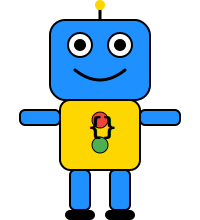

# كود المرح - تعليم البرمجة للأطفال باستخدام الذكاء الاصطناعي

<p align="center">
  
</p>

<div dir="rtl">

## نبذة عن المشروع

"كود المرح" هو تطبيق ويب تفاعلي يُمكن الأطفال من تعلّم البرمجة بطريقة ممتعة. يكتب الطفل تعليمات برمجية بصيغة طبيعية باللغة العربية (مثلاً: "ارسم زر أحمر يتحرك عند الضغط")، ويقوم الذكاء الاصطناعي بتحويلها إلى كود HTML/CSS/JS يتم عرضه فوراً في نافذة تجريبية.

## الميزات

- واجهة مستخدم كاملة باللغة العربية
- تخطيط RTL للدعم الكامل للغة العربية
- توليد كود تفاعلي باستخدام الذكاء الاصطناعي (Gemini)
- معاينة مباشرة للكود المولد في إطار تفاعلي
- اقتراحات للأوامر البرمجية للمبتدئين
- تصميم ملائم للأطفال مع شخصية روبوت ودية

## التقنيات المستخدمة

- **الواجهة الأمامية**: Next.js (App Router)
- **التنسيق**: Tailwind CSS مع دعم RTL
- **الذكاء الاصطناعي**: Google Gemini API
- **عرض الكود**: iframe srcDoc
- **اللغة**: 100% عربية (RTL)

## متطلبات التشغيل

1. يجب إضافة مفتاح Gemini API في ملف `.env.local`:

```
GEMINI_API_KEY=your_api_key_here
```

2. تثبيت التبعيات:

```bash
npm install
```

3. تشغيل خادم التطوير:

```bash
npm run dev
```

## الاستخدام

1. اكتب تعليمات برمجية بسيطة في مربع الإدخال باللغة العربية
2. انقر على زر "توليد الكود"
3. شاهد النتيجة مباشرة في المعاينة
4. جرب تعديل التعليمات لرؤية نتائج مختلفة

## المساهمة

نرحب بمساهماتكم لتحسين هذا المشروع التعليمي! يمكنكم إرسال طلبات السحب أو فتح قضايا جديدة.

</div>
